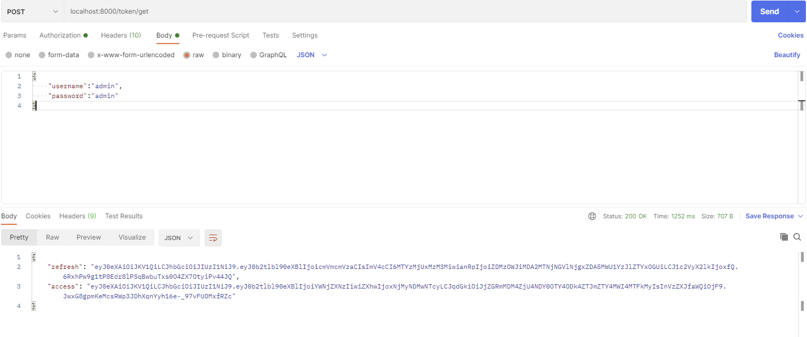
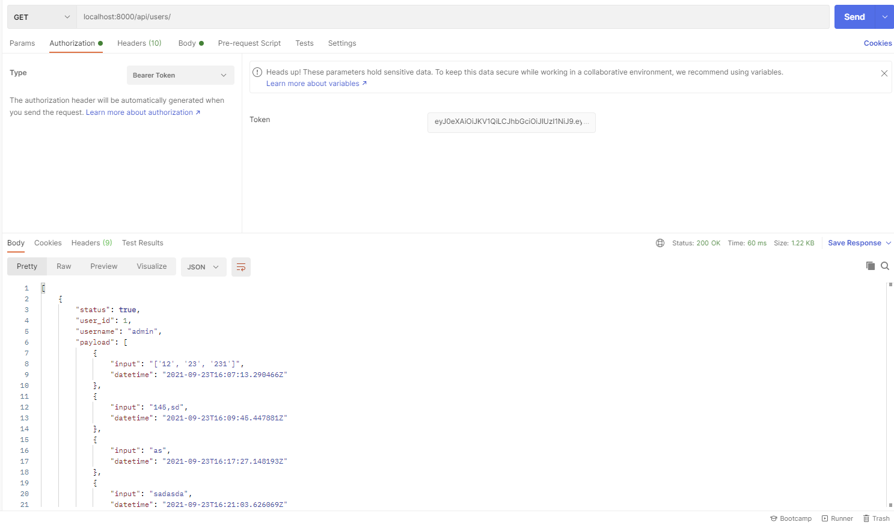

# Ami Code Pari Na

## [Demo](https://choosealicense.com/licenses/mit/)

## Software Used:
- Pycharm 2021.2 (Professional Edition)
## Language Used:
- Python
- HTML
- Javascript
## Frameworks Used:
- Django
- Talliwind Css
## Authentication:
- Simple-JWT


## How to run your code?
- Clone this repository
- Open the terminal in the project directory
- Execute those command
  ```python
    pip install -r requirements.txt
    py manage.py migrate
    py maange.py runserver
  ```
- it will run to default port:8000 in your localhost

# API
- "users"[get]: "/api/users/"       

- "users"[get]: "/api/users/[id]"        

- "usersearch[get]": "/api/usersearch/"

- "Token[post]": "/token/get

- "Token Refresh[post]": "/token/refresh

- "Token Varificatrion[post]": "/token/verify

> If you want to access 'users' API first you have to get access token user "https://yourdomain.com/token/get"
 URL with your 'username' and 'password' with the body like below the screenshot, and use this access token with 'Bearer token' in the Authorization section 


